# CarND-Behavioral-Cloning

The goal of this project was to train a deep neural network that would drive autonomously around the track in the simulator that was previously used to gather trainig data.

## Structure 

| File                         | Description                                                                     |
|------------------------------|---------------------------------------------------------------------------------|
| `model.py`                   | Model architecture and training pipeline.                                       |
| `data.py`                    | Keras generator that yields data with augmentation, preprocessing and batching. |
| `model.h5`                   | Model                                                                           |
| `drive.py`                   | Drives the car on the simulator given the trained model                         |

Simulator app was provided by Udacity to train and run the model.

## Data collection

Data was collected by 3 front facing cameras, one in the center of the car and one on each side. As you drive in the simulator it saves frames from the 3 cameras together with the corresponding steering angle, throttle position, brake and speed.

We'll use the images as input to the model and predict the steering angle between `-1` and `1`.

I've used data provided from Udacity and also gathered data from 2 laps driving on each direction on each track.

The resulting data set was very unbalanced as it included a lot of examples of small steering angles, driving relatively straight, and few high angles, drving trough sharp turns or hard corrections of direction.

I ended up collecting `21186` individual images and corresponding values.

## Data preprocessing and augmentation

As with any deep learning project one of the most important steps is the cleaning and augmentation of the data. 

In this case we had images from 3 diferent cameras, all corresponding to a single combination of steering angle, throttle, brake and speed values. This resulted in `63,558` images.

The data set was not extensive as to generalize the model well so I've decied to apply some augmentation techniques:

- **Side cameras:** We'll be using the central camera while driving as input to the model but we can use the side cameras during training by applying correction to the steering angle, `0.25` and `-0.25` to the left and right images respectevly, increasing the number of samples by 3.

```python
cameras            = ['left', 'center', 'right']
cameras_correction = [0.25, 0.0, -0.25]

camera     = np.random.randint(len(cameras))
image_path = os.path.join(root_path, data[cameras[camera]].values[i].strip())
image      = mpimg.imread(image_path)
angle      = data.steering.values[i] + cameras_correction[camera]
```

- **Image flip:** Another approch we can take is to flip the images horizontaly, like a mirror. This will help the model generalize better and fight a tendency to turn more to the left due to the higher number of left turns in the first track. 

```python
# Randomly flip half of images in the batch
flip_i    = random.sample(range(x.shape[0]), int(x.shape[0] / 2))
x[flip_i] = x[flip_i, :, ::-1, :]
y[flip_i] = -y[flip_i]
```

- **Cropping top and bottom of the images:** Looking at the images we can cleary see that the top of the image is composed mostly of scenery, not helping the model and adding noise. Also the bottom of the image includes mostly the bonet and also does not help the model. For this I've croppedt these undeed parts, randomly shiffting the window up and down by a delta of `5%` to help the model generalize better, specially for the second track where we have hills and descents.

```python
default_top_ratio  = 0.375
default_bot_tatio  = 0.125

# Randomly shift up and down while preprocessing
delta          = .05
rand_top_ratio = random.uniform(default_top_ratio - delta,
                                default_top_ratio + delta)
rand_bot_ratio = random.uniform(default_bot_tatio - delta,
                                default_bot_tatio + delta)

image = preprocess(image, top_ratio=rand_top_ratio, bot_ratio=rand_bot_ratio)
```

- **Adding Shadows:** Another techinque we can use to augement the data and help the model generalize better for different weather conditions is to add random shadows to the images. This is specially important for the second track wich has a lot of pieces of road with direct sunlight and shadow.

```python
# Add random shadow as a vertical slice of image
h, w     = image.shape[0], image.shape[1]
[x1, x2] = np.random.choice(w, 2, replace=False)
k        = h / (x2 - x1)
b        = - k * x1

for i in range(h):
    c = int((i - b) / k)
    image[i, :c, :] = (image[i, :c, :] * .5).astype(np.int32)
```

- **Normalization and scalling:** Finaly we normalize the pixel values and scale the image to a shape our model expects, `128x32` pixels with 3 RGP channels.

```python
img_w = 128
img_h = 32
img_c = 3

top_ratio  = 0.375
bot_tatio  = 0.125

top    = int(top_ratio * image.shape[0])
bottom = int(bot_ratio * image.shape[0])
image  = sktransform.resize(image[top:-bottom, :], (img_h, img_w, img_c))
```

### Augmentation example

Here we can see the **3** origal images, from the left, center and right front cameras, and the **16** generated by applying the augmentation pipeline.
The images are provided by a [generator](https://docs.python.org/3/tutorial/classes.html#generators) to improve performance during training. 

> Original images

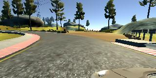 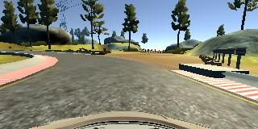 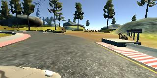 

> Augmented images

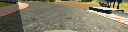 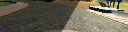 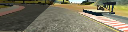 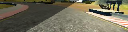

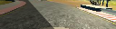 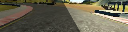 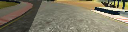 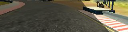

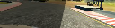 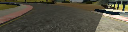 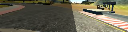 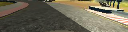

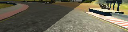 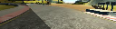 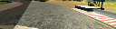 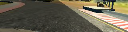

## Model

I've used a model designed by NVIDIA but simplified it for this project. The model is composed of **3 convolutional layers** followed by **3 fully connected layers**. Between the fully connected layers I applied a **dropout layer** of `50%` and `25%` to reduce overfitting. 

This can be easily coded using [Keras](https://keras.io/) as follows:

```python
model = Sequential()
model.add(Conv2D(16, (3, 3), activation='relu', input_shape=(32, 128, 3)))
model.add(MaxPooling2D(pool_size=(2, 2)))
model.add(Conv2D(32, (3, 3), activation='relu'))
model.add(MaxPooling2D(pool_size=(2, 2)))
model.add(Conv2D(64, (3, 3), activation='relu'))
model.add(MaxPooling2D(pool_size=(2, 2)))
model.add(Flatten())
model.add(Dense(500, activation='relu'))
model.add(Dropout(.5))
model.add(Dense(100, activation='relu'))
model.add(Dropout(.25))
model.add(Dense(20, activation='relu'))
model.add(Dense(1))
```
I used an **Adam optimizer** with a learning rate of `0.0001` and **mean squared error** as the loss function.

```python
model.compile(optimizer=Adam(lr=1e-04), loss='mean_squared_error')
```

The model was trained for **50 epochs** and achieved a loss of `0.0388` and a validation loss of `0.0404`.

## Results

The model performed very well and is able to **run indefinitely** around the first track and around 75% of the times on the second track, where, at times, it gets stuck on a corner.

I've attached a video of the car running a full lap on the first track `run1.mp4` and a second video of the car doing a pretty good job on the second track `run2.mp4`.
